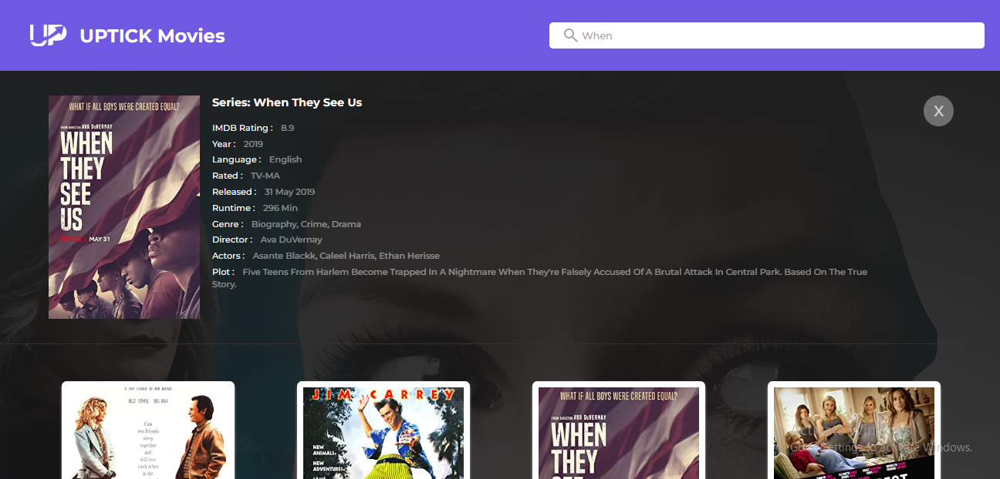

# Main Project

This is a simple web application created using React that the user can use to search for movies and get information about different movies.

## Requirements
-   The application should have a search bar and the ability to filter results by
genre and release date.
-   The application should use a popular frontend framework such as React,
Angular etc.
-   The application should display the results in a user-friendly format with
details about the movie such as title, release date, genre, and a short
overview.
-  The application should fetch the data from a public API.
-   Proper use of Git for version control.
-  Deploy your app to a hosting service (e.g Netlify, Vercel etc) and provide link

## Framework Used

### React:
This is a Javascript framework used to create UI components. To install, on your terminal input;

```bash
npx create-react-app uptick-movie-app
```

It was hosted using localhost:3000

## API Used:

[The Open Movie Database APIs](http://www.omdbapi.com/)

Generate API key from : [http://www.omdbapi.com/apikey.aspx](http://www.omdbapi.com/apikey.aspx)

### API Info:
- Method: `GET`
- Search URL: `https://www.omdbapi.com/?s={MOVIE_NAME}&apikey={API_KEY}`
- Movie Details URL: `https://www.omdbapi.com/?s={MOVIE_NAME}&apikey={API_KEY}`

### Icons & Font:
- Icons: `Iconfy`
- Font Link: `<link href="https://fonts.googleapis.com/css2?family=Montserrat:wght@300;400;500;600;700;800&display=swap" rel="stylesheet">`
- Font family: `font-family: 'Montserrat', sans-serif;`

### Libraries used:
- `styled-components`
- `axios`

### Debugging Tool:
- `React Developer Tool`

### Demo:

Deployed using Vercel:
[Uptick Movies](https://uptick-frontend-development.vercel.app/)

#### Screenshot of the app:



### *Thank you for reading*